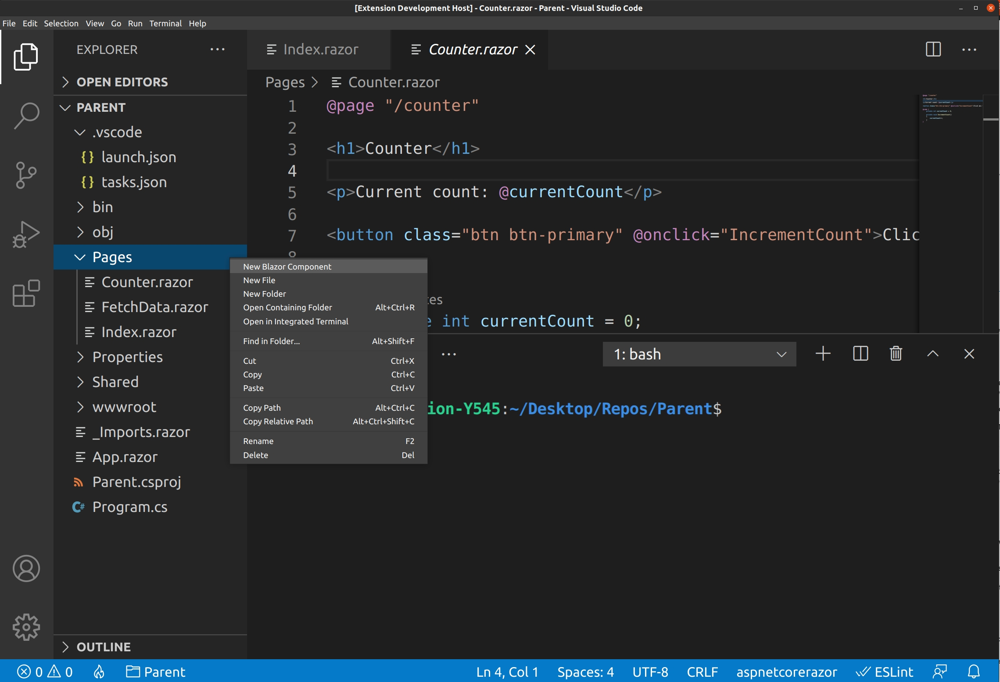
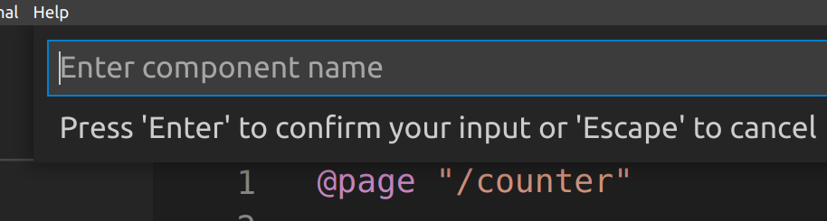
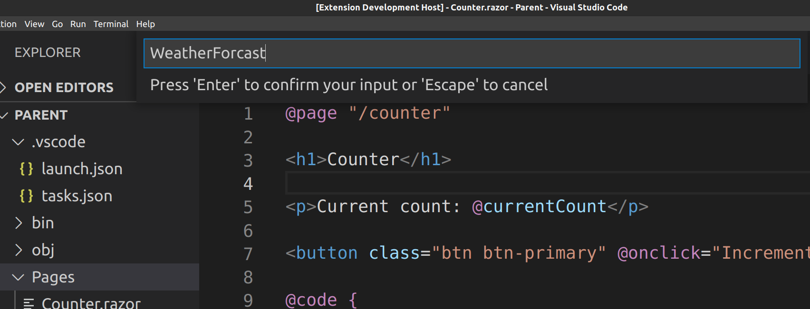
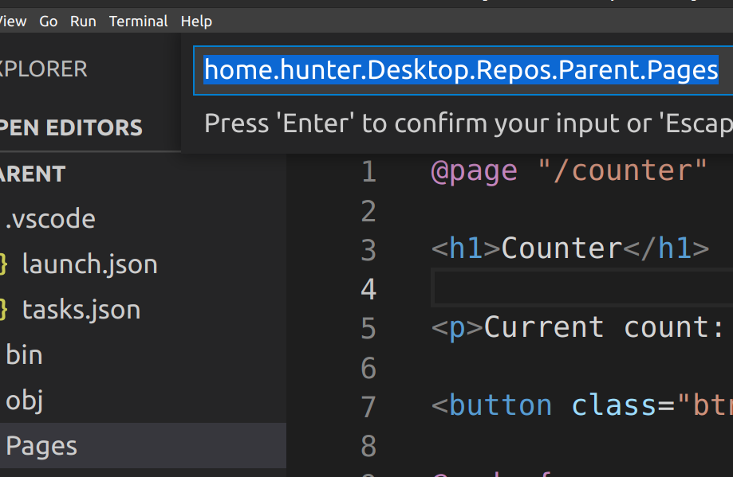
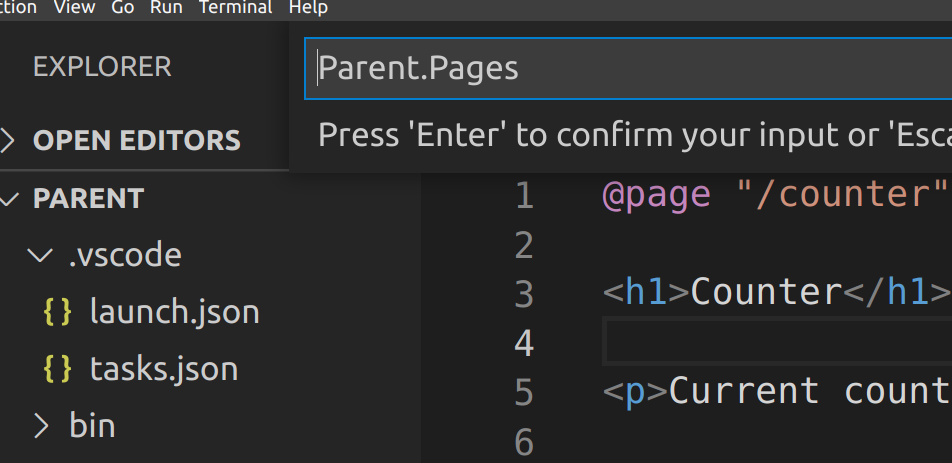
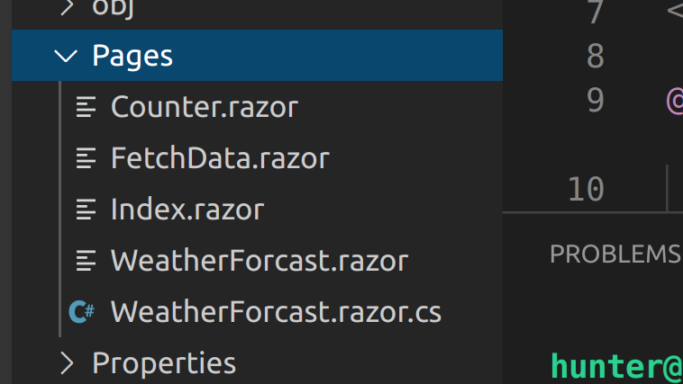
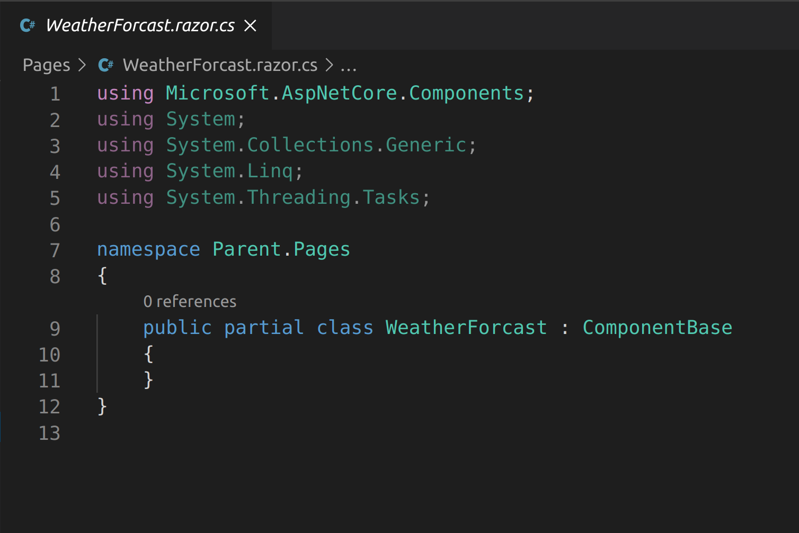
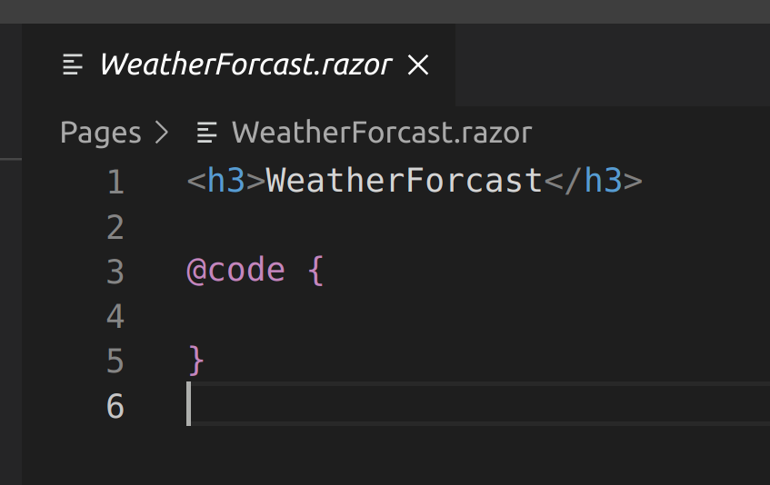

-First is the "too long didn't read" image showcase of the extension.
-Afterwards I use text to describe the extension.

Step 1: Create a blazor project and right click a folder then click 'New Blazor Component' in the context menu.

Step 2: Type in a component name

 

Step 3: (this step is here to showcase what I entered)

Step 4: Alter the generated namespace to your liking (or write a new one entirely)

Step 5: (this step is here to showcase what I entered)

Step 6: The WeatherForcast.razor and WeatherForcast.razor.cs files were created in the selected directory.

Step 7: (this step is here to showcase the generated code behind)

Step 8: (this step is here to showcase the generated razor markup)

Now I will begin using text to describe the extension.

This extension adds an option to the context menu when the event occurs on a folder in the workspace called 'New Blazor Component'.

The first step is to enter a component name. I chose WeatherForcast and then hit enter.

After entering the component name you are prompted again but this time for the namespace. The initial value in the textbox is the fsPath of the folder you context menu evented on but with periods instead of slashes and uppercase letters to start each word. I quickly remove everything prior to Parent.Pages using shift + home then backspace and then hit enter to submit.

As shown in the images the files 'WeatherForcast.razor' and 'WeatherForcast.razor.cs'. Spelling seems to not be my strong side I think it's spelt 'Forecast' but I hope we can ignore that.

Opening the 'WeatherForcast.razor.cs' will display the code behind of the component. It has everything auto generated that is needed to template a codebehind including a generated namespace.

Opening the 'WeatherForcast.razor' will display the razor markup of the component. It has everything auto generated that is needed to template a razor markup file. Razor files have namespaces defined by default by Microsoft's design. I could've said @namespace "${enteredNamespace}" but I felt that would be obnoxious.

The repo is on github publicly and is located at 'https://github.com/huntercfreeman/BlazorExtensionVSC'

I am working on other Blazor extensions for VSCode.

So, stay tuned for more.

I can be reached at huntercfreeman@gmail.com.

I will happily take extension requests the only requirement is that they are Blazor related.